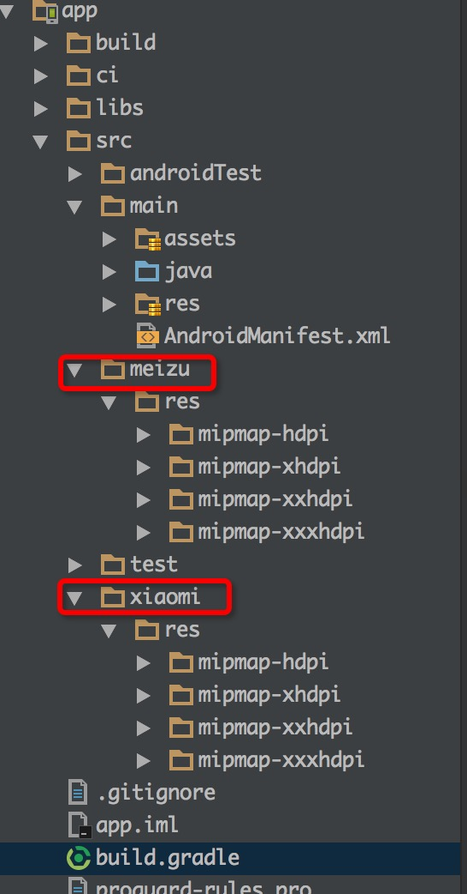

# 通过 gradle 自动配置一些参数

gradle 的功能真的是不可谓不强大, 我们可以在 gradle 做出很多自定义的配置
下面主要讲一下我在工作中遇到的一些配置项

## 前提
要做到,我们在 gradle做了一些配置,然后我们在 java 代码中能够读取到对应的配置值, 这点很重要.
这里就需要用到 `BuildConfig` 则个类了

`BuildConfig` 这个类是 gradle 在编译的过程中自动生成的一个类

先看看我想买中生成的`BuildConfig`文件:
```
public final class BuildConfig {
  public static final boolean DEBUG = Boolean.parseBoolean("true");
  public static final String APPLICATION_ID = "com.zuiapps.zuiworld";
  public static final String BUILD_TYPE = "debug";
  public static final String FLAVOR = "normal";
  public static final int VERSION_CODE = 10002;
  public static final String VERSION_NAME = "1.0.2.dev";
  // Fields from product flavor: normal
  public static final String API_BASE_URL = "http://xxxx.zuimeia.com/";
  // Fields from default config.
  public static final String CHANNEL = "";
}
```

这个类是直接可以在代码中引用的, 同样我们在 gradle 文件中做出的一些配置也会反应到这个文件中.

下面举三个我在项目中遇到的自动配置例子

## 例子1: 自动开关 Log

一般我们在打 release 包的时候都需要吧 Log 给关掉,
对了这里我也相信大多数的项目中都有 LogUtil 类似的这么一个类, 里面能够设置 log 开关什么的

这里我们就可以用到 `BuildConfig.DEBUG` 来判断是否是 release 包, 从而做到 log 的打开与关闭
```
LogUtil.setLogEnable(BuildConfig.DEBUG);
```

## 例子2: 自动配置api 的测试环境 和正式环境
多数情况我们都是在代码中写一个常量设置 BaseApi的 URL
但是有很多时候, QA 人员需要在测试环境和正式环境中来回切换, 对于我们开发来说倒是挺简单的, 改个变量在编译一下现在有了 instant run. 但是对于QA来说,总不能每次要就再改个变量再打个包给他们吧
这里其实可以使用 gradle 自动化配置, 打一个正式环境的包, 再打一个测试环境的包

这里就需要用到gradle 中的productFlavors了, 多渠道打包的时候大家都应该见过(但是如果是这样多渠道打包的话.真心挺费时间的,可以考虑其他方法打渠道包)

```
productFlavors {
    normal {
        buildConfigField 'String', 'API_BASE_URL', '"http://xxxx.zuimeia.com/"'
    }
    qa {
        buildConfigField 'String', 'API_BASE_URL', '"http://xxxxtest.zuimeia.com/"'
    }
    instant {
        // 这样 会相对快一些
        buildConfigField 'String', 'API_BASE_URL', "${cfg.test_base_url}"
        minSdkVersion 21
    }
}
```

从上面的代码可以看到整个3个渠道, 一个真实环境的一个测试环境的, 还有一个只是为了更快的 instant 打包的,开发的时候一般用这个.
关于多渠道打包的知识这里不多做解释,
下面重点看这句:
```
buildConfigField 'String', 'API_BASE_URL', '"http://desig.zuimeia.com/"'
```

这句的意思是我们在 BuildConfig 类中加入一个String 常量,名字是 API_BASE_URL 值是"http://xxxx.zuimeia.com/".
需要注意的是, 这里 是一开始一个单引号, 然后里面就是 双引号+内容了.  这个自己多试几遍就知道了.

然后我们在应用 BASE_API_URL 的时候课直接使用 gradle 中配置了:
```
String API_BASE_URL = BuildConfig.API_BASE_URL;
```

## 一些特殊渠道的配置
现在网上关于多渠道打包的文章不少,都很少推荐直接所示用 `productFlavors` 这样的方式打渠道包.
但是有一些渠道还必须这样打, 如小米, 魅族.
我们公司的产品都会为针对小米和魅族单独制作 Icon, 如果使用一些通用的打渠道包的方式,来打的话就不那么适用了.
所以这里还是要使用 productFlavors 来打小米和魅族的渠道包.

```
productFlavors {
    xiaomi {buildConfigField 'String', 'CHANNEL', '"xiaomi"'}
    meizu {buildConfigField 'String', 'CHANNEL', '"meizu"'}

    normal {
        buildConfigField 'String', 'API_BASE_URL', '"http://xxx.zuimeia.com/"'
    }
    qa {
        buildConfigField 'String', 'API_BASE_URL', '"http://xxxtest.zuimeia.com/"'
    }
    instant {
        // 这样 会相对快一些
        buildConfigField 'String', 'API_BASE_URL', "${cfg.test_base_url}"
        minSdkVersion 21
    }
}
```

当然为了能够在打小米的包的时候使用小米的 icon, 打魅族包的时候使用魅族的 Icon 那么需要在src 目录下加入xiaomi和mmeizu 的资源文件
如下图:


# 注意
当我在productFlavors 中住了一些自定义的配置,还需要在defaultConfig 中做一些默认配置.
其实看上面就能看出来, 当我打小米渠道的时候没有指明 API_BASE_URL 那是因为我配置默认的API_BASE_URL, 如果使用默认的值就再次不需要指明了
看如下默认配置:
```
defaultConfig {
    applicationId cfg.applicationId
    minSdkVersion cfg.minSdkVersion
    targetSdkVersion cfg.targetSdkVersion
    versionCode cfg.versionCode
    versionName cfg.versionName

    multiDexEnabled true

    buildConfigField 'String', 'API_BASE_URL', "${cfg.normal_base_url}"
    buildConfigField 'String', 'CHANNEL', '""'
}
```

# 结语
基本关于 gradle 自动化配置参数的一些内存差不多了. 关于一些打渠道包的方法网上应该有不少,这里不多讲
还有上面关于 `$`获取变量值的 这个其实很简单的看一些看开源项目的什么的就能 get 的技能了, 这也不多做介绍了

以上, 感谢阅读
