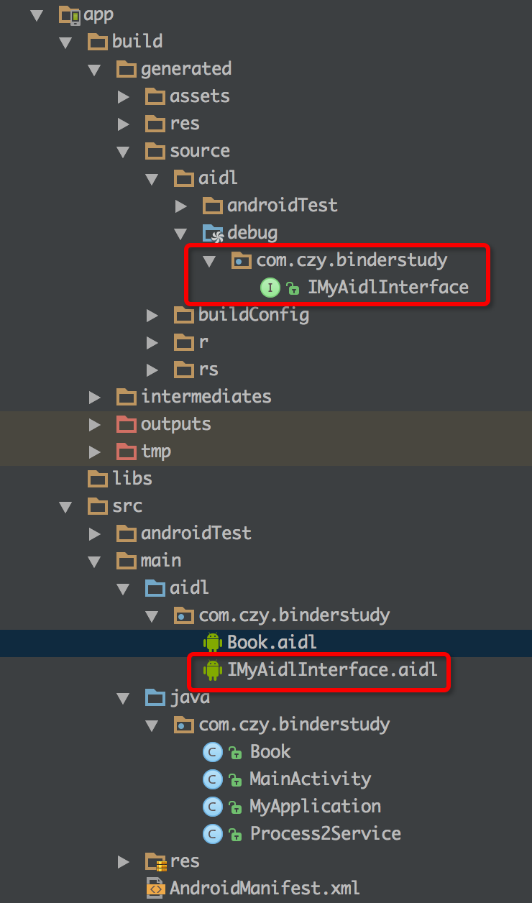

#深入理解 binder 

在 Android 开发的过程中难会遇到多进程之间通信的问题.
好在 Android 官方给我们一个想多不错的解决方案 AIDL, 通过 binder 来进行多进程之间的通信

先来简单的复习一个 官方的 AIDL

##1. 先定义一个 AIDL接口文件

```
package com.czy.binderstudy;

// 这里应用必须要有包名
import com.czy.binderstudy.Book;

interface IMyAidlInterface {
    // 一些基本类型
    void basicTypes(int anInt, long aLong, boolean aBoolean, float aFloat,
            double aDouble, String aString);

    // 不能重载方法, 不然编译不通过
    // void basicTypes(int anInt);

    int getPid();

    void addBook(in Book book);

    Book getBook();
}

```

注意上面我用到了 Book这个类,在 AIDL 中如果需要使用自定义的类的话,需要做到以下3点:
a. 实现Parcelable
b. 针对该类生成一个对应的 aidl 文件
c. 在 AIDL 接口文件中 import 该类

还有就是在 AIDL 文件中不能重载方法, 即一个方法名只能出现一次, 不然编译不通过(有点诡异)

Book 对应 aidl 文件如下, 只有两行代码
```
// Book.aidl
package com.czy.binderstudy;
parcelable Book;

```

##2. Android Studio 编译生成 java 文件
上面我们定义了相应的 aidl 接口文件,那么 AndroidStudio 在编译的时候则会生成相应的 java 文件,
文件内容这一节暂且不管
生成的文件位置如下:



##3. 定义 Service, 实现 AIDL 接口
更具上面生成的 java 文件来实现相应的 AIDL 接口
Service 代码如下:
```
public class Process2Service extends Service {
    private static final String TAG = "Process2Service";

    @Override
    public void onCreate() {
        super.onCreate();
        Log.w(TAG, "onCreate() called with: " + "");
    }

    @Override
    public int onStartCommand(Intent intent, int flags, int startId) {
        Log.w(TAG, "onStartCommand() called with: " + "intent = [" + intent + "], flags = [" + flags + "], startId = [" + startId + "]");
        return super.onStartCommand(intent, flags, startId);
    }

    @Nullable
    @Override
    public IBinder onBind(Intent intent) {
        return mBinder;
    }

    private IMyAidlInterface.Stub mBinder = new IMyAidlInterface.Stub() {
        @Override
        public void basicTypes(int anInt, long aLong, boolean aBoolean, float aFloat, double aDouble, String aString) throws RemoteException {
            Log.w(TAG, "basicTypes() called with: " + "anInt = [" + anInt + "], aLong = [" + aLong + "], aBoolean = [" + aBoolean + "], aFloat = [" + aFloat + "], aDouble = [" + aDouble + "], aString = [" + aString + "]");
        }

        @Override
        public int getPid() throws RemoteException {
            return Process.myPid();
        }

        @Override
        public void addBook(Book book) throws RemoteException {
            Log.w(TAG, "addBook() called with: " + "book = [" + book + "]");
        }

        @Override
        public Book getBook() throws RemoteException {
            return new Book(100, "book");
        }
    };
}
```

在 service 的 onBinder 方法中 返回我们刚刚实现的 aidl 方法接口对象
```
@Nullable
@Override
public IBinder onBind(Intent intent) {
    return mBinder;
}
```

然后在 manifest 文件中申明该 service, 同时需要声明为其他线程
```
<service
    android:name=".Process2Service"
    android:process=":process2"
    />
```

## bindService,执行远程 AIDL 方法
想要执行远程的 AIDL 方法, 首先需要 Binder 对应的 Service
在Context 中有bindService, 我们就是通过该方法来 连接 远程 Service.
>>这里有一个概念需要搞清, 我们一般把方法的调用者称之为客户端, 而对应方法的执行者称之为服务端(即 远程 service)

先看如下连接远程 Service 的代码:
```
private void bindService() {
    Intent intent = new Intent(this, Process2Service.class);
    bindService(intent, new ServiceConnection() {
        @Override
        public void onServiceConnected(ComponentName componentName, IBinder iBinder) {
            Log.d(TAG, "onServiceConnected() called with: " + "componentName = [" + componentName + "], iBinder = [" + iBinder + "]");
            mIMyAidlInterface = IMyAidlInterface.Stub.asInterface(iBinder);
            Toast.makeText(getContext(), "binder Connected", Toast.LENGTH_SHORT).show();

        }

        @Override
        public void onServiceDisconnected(ComponentName componentName) {
            mIMyAidlInterface = null;
            Toast.makeText(getContext(), "binder Disconnected", Toast.LENGTH_SHORT).show();

        }
    }, Context.BIND_AUTO_CREATE);
    //Context.BIND_AUTO_CREATE  表示当 service 没有启动时则 自动启动 onCreate 
}
```

bindService 有3个参数
第一个参数 intent, 不必多说, 指明我们要 binder 的是哪个 Service
第二个参数 一个 ServiceConnection 对象, 该对象中有两个回调方法, 表明练车连接成功, 和 断开连接
第三个参数 int 类型, 表示 Service 的启动模式 一般为Context.BIND_AUTO_CREATE, 表示当Service 没有启动时,则自动启动

##4. 总结
关于 AIDL 的基本使用方法就是上面那些了,其实官网的接收更为先详细,
官网中该介绍有通过Messenger 来发送数据实现, Service 端的 Handler 来接收数据 的方法来实现款进程通信
官网地址:https://developer.android.com/guide/components/bound-services.html


